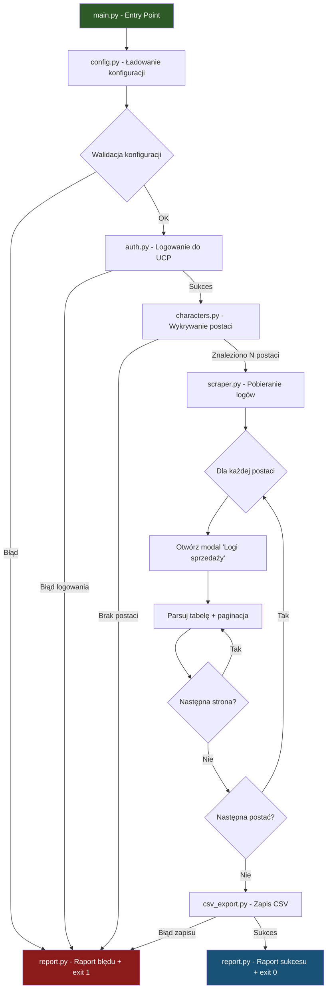
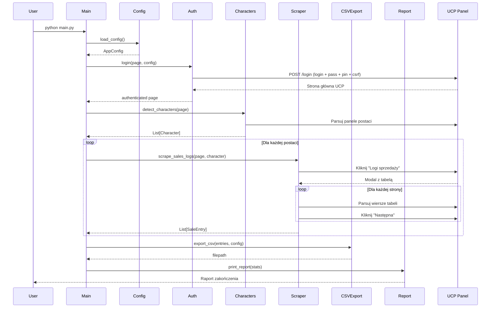
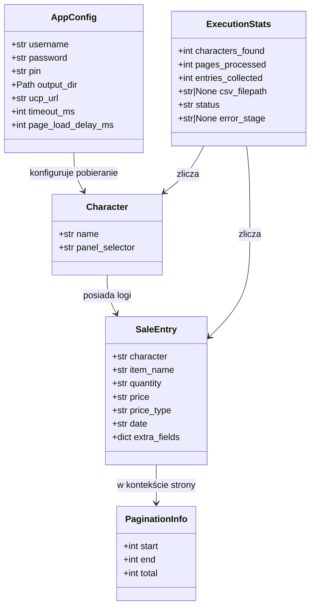

# Dokument Projektowy: Metin Hard UCP Scraper

## Przegląd

Program to jednorazowy skrypt w Pythonie wykorzystujący Playwright do automatycznego logowania się do panelu UCP serwera Metin2 (https://projekt-hard.eu/ucp), wykrywania wszystkich postaci na koncie, pobierania kompletnych logów sprzedaży z każdej postaci (z obsługą paginacji) i eksportowania ich do pliku CSV.

Program działa w modelu "uruchom → wykonaj → zakończ" — bez trybu usługi, bez bazy danych, bez persystencji stanu między uruchomieniami.

### Kluczowe decyzje projektowe

| Decyzja | Wybór | Uzasadnienie |
|---------|-------|--------------|
| Automatyzacja przeglądarki | Playwright (sync API) | Wymagane w ograniczeniach; sync API prostsze dla skryptu jednorazowego |
| Format konfiguracji | TOML (`config.toml`) | Czytelny, natywnie wspierany w Pythonie 3.11+ (`tomllib`) |
| Persystencja | Brak (tylko CSV na wyjściu) | Właściciel wykluczył SQLite; brak potrzeby stanu między uruchomieniami |
| Paginacja | Iteracja "Następna" + walidacja licznika | Niezawodna niezależnie od liczby stron |
| Struktura kodu | Moduły funkcjonalne | Testowalność, separacja logiki od I/O |

## Architektura

### Diagram wysokopoziomowy



### Diagram sekwencji



## Komponenty i interfejsy

### 1. `main.py` — Punkt wejścia i orkiestracja

Odpowiedzialność: Koordynacja przepływu programu, obsługa błędów najwyższego poziomu.

```python
def main() -> int:
    """Główna funkcja orkiestrująca. Zwraca exit code."""
    ...
```

### 2. `config.py` — Zarządzanie konfiguracją

Odpowiedzialność: Ładowanie, walidacja i dostarczanie konfiguracji.

```python
@dataclass
class AppConfig:
    username: str
    password: str
    pin: str
    output_dir: Path
    ucp_url: str = "https://projekt-hard.eu/ucp"
    timeout_ms: int = 30000
    page_load_delay_ms: int = 1000

def load_config(config_path: Path = Path("config.toml")) -> AppConfig:
    """Ładuje i waliduje konfigurację z pliku TOML."""
    ...

class ConfigError(Exception):
    """Błąd konfiguracji z czytelnym komunikatem."""
    ...
```

**Format pliku `config.toml`:**
```toml
[credentials]
username = "login"
password = "hasło"
pin = "12345"

[output]
directory = "C:\\Users\\user\\Documents\\metin_logs"

[scraper]
timeout_ms = 30000
page_load_delay_ms = 1000
```

### 3. `auth.py` — Uwierzytelnienie

Odpowiedzialność: Logowanie do panelu UCP, weryfikacja sukcesu logowania.

```python
def login(page: Page, config: AppConfig) -> None:
    """
    Loguje się do UCP. 
    Raises: AuthError jeśli logowanie nie powiodło się.
    """
    ...

def verify_logged_in(page: Page) -> bool:
    """Sprawdza czy strona wskazuje na zalogowany stan."""
    ...

class AuthError(Exception):
    """Błąd uwierzytelnienia."""
    ...
```

**Strategia logowania:**

Panel UCP ukrywa formularz logowania w dropdown menu. Wymagane kroki:

1. Nawiguj do `ucp_url`
2. Zamknij cookie consent banner (kliknij `#cok_accept` jeśli widoczny)
3. Kliknij przycisk rozwijający formularz (`button.btn-success.dropdown-toggle`)
4. Poczekaj na pojawienie się formularza logowania
5. Wypełnij pola:
   - `input[name='login']` — nazwa użytkownika
   - `input[name='pass']` — hasło
   - `input[name='_pin']` — 5-cyfrowy PIN
6. Kliknij przycisk submit (`button[type='submit'].btn-success`)
7. Poczekaj na załadowanie strony (networkidle)
8. Zweryfikuj sukces: brak formularza logowania + obecność elementów zalogowanego stanu
9. Jeśli formularz nadal widoczny → `AuthError("Nieprawidłowe dane logowania")`

**Uwagi techniczne:**
- Formularz wysyła POST do `/login` (nie `/ucp`)
- Formularz zawiera token CSRF (`input[name='csrf_login']`) — Playwright automatycznie go uwzględnia
- Ukryte pola: `logMe="yes"`, `load="site"` — wypełnione automatycznie w formularzu
- Pole login: min 4, max 40 znaków
- Pole hasło: max 32 znaki
- Pole PIN: dokładnie 5 znaków

### 4. `characters.py` — Wykrywanie postaci

Odpowiedzialność: Identyfikacja wszystkich postaci na stronie głównej UCP.

```python
@dataclass
class Character:
    name: str
    panel_selector: str  # Selektor do panelu danej postaci

def detect_characters(page: Page) -> list[Character]:
    """
    Wykrywa postacie na stronie głównej UCP.
    Raises: ScraperError jeśli nie znaleziono żadnej postaci.
    """
    ...
```

**Strategia wykrywania:**
- Szukaj powtarzalnych elementów DOM reprezentujących panele postaci
- Każdy panel zawiera nazwę postaci i przycisk "Logi sprzedaży"
- Ekstrakcja nazwy postaci z tekstu panelu
- Zapis selektora dla późniejszego kliknięcia "Logi sprzedaży"

### 5. `scraper.py` — Pobieranie logów sprzedaży

Odpowiedzialność: Otwieranie modali logów, parsowanie tabel, obsługa paginacji.

```python
@dataclass
class SaleEntry:
    character: str
    item_name: str
    quantity: str
    price: str
    price_type: str
    date: str
    extra_fields: dict[str, str]  # Dodatkowe kolumny

@dataclass  
class PaginationInfo:
    start: int      # X w "Pozycje od X do Y z Z łącznie"
    end: int        # Y
    total: int      # Z

def scrape_sales_logs(page: Page, character: Character, config: AppConfig) -> list[SaleEntry]:
    """
    Pobiera wszystkie logi sprzedaży dla danej postaci.
    Obsługuje paginację automatycznie.
    """
    ...

def parse_pagination_info(text: str) -> PaginationInfo:
    """
    Parsuje tekst paginacji: 'Pozycje od X do Y z Z łącznie'.
    Raises: ParseError jeśli format nierozpoznany.
    """
    ...

def parse_table_row(row_element, headers: list[str], character_name: str) -> SaleEntry:
    """Parsuje pojedynczy wiersz tabeli na SaleEntry."""
    ...

def parse_table_headers(table_element) -> list[str]:
    """Wyodrębnia nagłówki kolumn z tabeli."""
    ...
```

**Strategia paginacji:**
1. Otwórz modal "Logi sprzedaży" dla postaci
2. Odczytaj `PaginationInfo` — poznaj łączną liczbę wpisów (`Z`)
3. Parsuj nagłówki tabeli (obsługuj dodatkowe kolumny)
4. Parsuj wszystkie wiersze na bieżącej stronie
5. Jeśli istnieje przycisk "Następna" i nie jest wyłączony → kliknij, wróć do 4
6. Zweryfikuj: `len(collected_entries) == Z`
7. Zamknij modal

### 6. `csv_export.py` — Eksport do CSV

Odpowiedzialność: Generowanie pliku CSV z pobranych danych.

```python
def export_to_csv(entries: list[SaleEntry], output_dir: Path) -> Path:
    """
    Eksportuje wpisy do pliku CSV.
    Returns: Ścieżka do utworzonego pliku.
    Raises: ExportError jeśli zapis nie powiódł się.
    """
    ...

def generate_filename() -> str:
    """Generuje nazwę pliku: sales_log_YYYY-MM-DD_HH-MM-SS.csv"""
    ...

def build_csv_headers(entries: list[SaleEntry]) -> list[str]:
    """
    Buduje listę nagłówków CSV.
    Zawiera kolumny stałe + dynamiczne (extra_fields).
    """
    ...
```

**Kolumny CSV (minimalne):**
- `Character` — nazwa postaci
- `Nazwa przedmiotu` — nazwa sprzedanego przedmiotu
- `Ilość` — ilość sztuk
- `Cena` — kwota transakcji
- `Typ ceny` — waluta/typ
- `Data` — data transakcji
- (+ wszelkie dodatkowe kolumny z panelu UCP)

**Parametry CSV:**
- Separator: `,` (standardowy)
- Kodowanie: UTF-8 z BOM (`utf-8-sig` dla kompatybilności z Excelem)
- Quoting: cytowanie pól zawierających separator, cudzysłów lub nową linię

### 7. `report.py` — Raport zakończenia

Odpowiedzialność: Formatowanie i wyświetlanie raportu na stdout.

```python
@dataclass
class ExecutionStats:
    characters_found: int
    pages_processed: int
    entries_collected: int
    csv_filepath: str | None
    status: str  # "SUCCESS" lub opis błędu
    error_stage: str | None  # etap na którym wystąpił błąd

def format_report(stats: ExecutionStats) -> str:
    """Formatuje raport zakończenia jako string."""
    ...

def print_report(stats: ExecutionStats) -> None:
    """Wyświetla raport na stdout."""
    ...
```

**Format raportu:**
```
========================================
  RAPORT ZAKOŃCZENIA
========================================
Status:             SUCCESS
Postaci wykrytych:  3
Stron przetworzonych: 47
Wpisów pobranych:   465
Plik CSV:           sales_log_2024-01-15_14-30-22.csv
========================================
```

### 8. `errors.py` — Hierarchia błędów

```python
class ScraperError(Exception):
    """Bazowy błąd scrapera."""
    stage: str  # "login", "characters", "scraping", "export"

class AuthError(ScraperError):
    stage = "login"

class CharacterDetectionError(ScraperError):
    stage = "characters"

class PaginationError(ScraperError):
    stage = "scraping"

class ParseError(ScraperError):
    stage = "scraping"

class SessionExpiredError(ScraperError):
    stage = "scraping"

class ExportError(ScraperError):
    stage = "export"

class ConfigError(ScraperError):
    stage = "config"
```

## Modele danych

### Diagram modeli



### Przepływ danych

```
config.toml → AppConfig → [Auth] → Page(zalogowana)
                                        ↓
                              [Characters] → List[Character]
                                        ↓
                              [Scraper] → List[SaleEntry] (per character)
                                        ↓
                              [CSVExport] → plik .csv
                                        ↓
                              [Report] → stdout (ExecutionStats)
```

## Właściwości Poprawności

*Właściwość (property) to cecha lub zachowanie, które powinno być prawdziwe dla wszystkich poprawnych wykonań systemu — formalny opis tego, co system powinien robić. Właściwości łączą specyfikacje czytelne dla ludzi z gwarancjami weryfikowalnymi maszynowo.*

### Property 1: Kompletność wykrywania postaci

*Dla dowolnego* poprawnego HTML strony UCP zawierającego N paneli postaci (N ≥ 1), funkcja `detect_characters` SHALL zwrócić dokładnie N obiektów `Character`, każdy z unikalną, niepustą nazwą.

**Validates: Requirements 2.1, 2.2**

### Property 2: Kompletność przetwarzania postaci

*Dla dowolnej* listy N wykrytych postaci, program SHALL wywołać pobieranie logów sprzedaży dla każdej z N postaci (żadna nie zostanie pominięta).

**Validates: Requirements 2.3**

### Property 3: Parsowanie informacji o paginacji

*Dla dowolnych* dodatnich liczb całkowitych X, Y, Z gdzie X ≤ Y ≤ Z, funkcja `parse_pagination_info` wywołana na stringu "Pozycje od X do Y z Z łącznie" SHALL zwrócić `PaginationInfo(start=X, end=Y, total=Z)`.

**Validates: Requirements 3.3**

### Property 4: Kompletność paginacji

*Dla dowolnej* tabeli logów z Z wpisami rozłożonymi na ceil(Z/10) stronach, scraper SHALL zebrać dokładnie Z wpisów.

**Validates: Requirements 3.1, 3.2**

### Property 5: Kompletność parsowania wierszy

*Dla dowolnego* wiersza tabeli HTML zawierającego K kolumn (K ≥ 5), funkcja `parse_table_row` SHALL wyekstrahować wartości dla wszystkich K kolumn — wymagane w dedykowanych polach, dodatkowe w `extra_fields`.

**Validates: Requirements 3.4, 3.5**

### Property 6: Round-trip CSV — dane wejściowe = dane wyjściowe

*Dla dowolnej* listy obiektów `SaleEntry` z przypisanymi nazwami postaci, eksport do CSV a następnie odczyt tego CSV SHALL odtworzyć wszystkie oryginalne wpisy z zachowaniem wartości wszystkich pól (w tym pola `character`).

**Validates: Requirements 4.1, 4.5, 4.6, 4.7**

### Property 7: Zachowanie znaków Unicode w CSV

*Dla dowolnego* `SaleEntry` zawierającego znaki Unicode (polskie znaki, emoji, znaki specjalne), eksport i ponowny odczyt CSV SHALL zachować identyczną wartość tekstową.

**Validates: Requirements 4.3**

### Property 8: Kompletność raportu zakończenia

*Dla dowolnego* obiektu `ExecutionStats` (sukces lub błąd), funkcja `format_report` SHALL wygenerować string zawierający: liczbę postaci, liczbę stron, liczbę wpisów, nazwę pliku (lub info o braku) oraz status.

**Validates: Requirements 6.1, 6.2, 6.3, 6.4, 6.5, 6.6**

### Property 9: Identyfikacja etapu błędu

*Dla dowolnego* wyjątku `ScraperError` z przypisanym polem `stage`, komunikat błędu prezentowany użytkownikowi SHALL zawierać informację o etapie, na którym wystąpił błąd.

**Validates: Requirements 7.1**

### Property 10: Walidacja konfiguracji wykrywa brakujące pola

*Dla dowolnej* konfiguracji TOML z brakującym przynajmniej jednym wymaganym polem (username, password lub pin), funkcja `load_config` SHALL rzucić `ConfigError` z komunikatem wskazującym brakujące pole.

**Validates: Requirements 8.3**

## Selektory UCP (potwierdzone eksperymentem integracyjnym)

Poniższe selektory zostały zweryfikowane na rzeczywistym panelu UCP (27.06.2026):

### Strona logowania

| Element | Selektor CSS | Uwagi |
|---------|-------------|-------|
| Cookie consent — przycisk Accept | `#cok_accept` | Widoczny przy pierwszej wizycie |
| Przycisk rozwijający formularz | `button.btn-success.dropdown-toggle` | Tekst: "Login" |
| Pole login | `input[name='login']` | id: `login-email`, min 4, max 40 znaków |
| Pole hasło | `input[name='pass']` | id: `login-password`, max 32 znaki |
| Pole PIN | `input[name='_pin']` | id: `login-pin`, dokładnie 5 znaków |
| Token CSRF | `input[name='csrf_login']` | Wartość dynamiczna, ukryte pole |
| Przycisk submit | `button[type='submit'].btn-success` | Tekst: "Log In" |
| Formularz logowania | `form[action='/login']` | method: POST |

### Strona główna (po zalogowaniu)

_Do potwierdzenia w kolejnym eksperymencie po zalogowaniu._

## Obsługa błędów

### Strategia ogólna

Program stosuje podejście **fail-fast z czytelnym raportem**:
- Błędy krytyczne (login, brak postaci, zapis CSV) → natychmiastowe zakończenie z raportem
- Błędy podczas scrapingu → próba kontynuacji z informacją w raporcie
- Wszystkie wyjątki łapane w `main()` i tłumaczone na czytelne komunikaty

### Tabela błędów

| Etap | Typ błędu | Akcja |
|------|-----------|-------|
| Konfiguracja | Brak pliku / brakujące pola | Exit 1 + komunikat |
| Konfiguracja | Nieistniejący folder wyjściowy | Exit 1 + komunikat |
| Logowanie | Nieprawidłowe dane | Exit 1 + komunikat |
| Logowanie | Panel niedostępny (timeout) | Exit 1 + komunikat |
| Wykrywanie postaci | Brak postaci | Exit 1 + komunikat |
| Scraping | Sesja wygasła | Exit 1 + raport częściowy |
| Scraping | Timeout strony | Retry 1x, potem exit 1 |
| Scraping | Nieoczekiwana struktura DOM | Exit 1 + raport z informacją o postaci |
| Eksport CSV | Błąd zapisu (uprawnienia/dysk) | Exit 1 + komunikat |

### Wykrywanie wygaśnięcia sesji

- Po każdym kliknięciu "Następna" lub otwarciu modalu: sprawdź czy nie nastąpiło przekierowanie do strony logowania
- Detekcja: obecność formularza logowania lub brak elementów strony głównej UCP
- Reakcja: `SessionExpiredError` → raport z informacją ile danych udało się pobrać

### Timeouty

- Nawigacja strony: `timeout_ms` (domyślnie 30s)
- Oczekiwanie na modal: 10s
- Oczekiwanie na tabelę w modalu: 10s
- Oczekiwanie na załadowanie następnej strony: `page_load_delay_ms` (domyślnie 1s) + wait for network idle

## Strategia testowania

### Testy jednostkowe (pytest)

Testowanie czystych funkcji logicznych w izolacji od przeglądarki:

- `parse_pagination_info()` — różne formaty tekstu paginacji
- `parse_table_row()` — wiersze z różną liczbą kolumn
- `parse_table_headers()` — nagłówki z/bez dodatkowych kolumn
- `generate_filename()` — format nazwy pliku
- `format_report()` — format raportu dla różnych stanów
- `load_config()` — walidacja konfiguracji (brakujące pola, niepoprawne wartości)
- `build_csv_headers()` — generowanie nagłówków CSV

### Testy property-based (Hypothesis)

Biblioteka: **Hypothesis** (standardowa biblioteka PBT dla Pythona)

Konfiguracja: minimum 100 iteracji na test (`@settings(max_examples=100)`)

Każdy test property-based odpowiada jednej Właściwości Poprawności z sekcji powyżej:

| Property | Funkcja testowana | Generator |
|----------|------------------|-----------|
| 1 | `detect_characters` (logika parsowania) | Losowy HTML z N panelami postaci |
| 2 | Orkiestracja (mock) | Losowe listy postaci |
| 3 | `parse_pagination_info` | Losowe trójki (X, Y, Z) |
| 4 | Logika paginacji (mock) | Losowe dane rozłożone na strony |
| 5 | `parse_table_row` | Losowe wiersze z K kolumnami |
| 6 | `export_to_csv` + odczyt | Losowe `SaleEntry` z różnymi postaciami |
| 7 | `export_to_csv` + odczyt | `SaleEntry` z Unicode |
| 8 | `format_report` | Losowe `ExecutionStats` |
| 9 | Formatowanie błędów | Losowe `ScraperError` z różnymi stage |
| 10 | `load_config` | Losowe TOML z brakującymi polami |

Tagowanie testów:
```python
# Feature: metin-hard-ucp-scraper, Property 3: Parsowanie informacji o paginacji
@given(x=st.integers(1, 1000), y=st.integers(1, 1000), z=st.integers(1, 10000))
@settings(max_examples=100)
def test_pagination_info_parsing(x, y, z):
    ...
```

### Testy integracyjne

- **Test logowania** — z prawdziwym panelem UCP (opcjonalny, wymaga danych)
- **Test end-to-end** — pełny przepływ z mockiem przeglądarki lub prawdziwym panelem

### Co NIE jest testowane property-based

- Interakcja z prawdziwym panelem UCP (INTEGRATION)
- Tworzenie pliku w określonym folderze (EXAMPLE)
- Kody wyjścia (EXAMPLE)
- Wykrywanie wygaśnięcia sesji (EXAMPLE)
- Layout/wygląd raportu (nie jest funkcjonalnym wymogiem)
